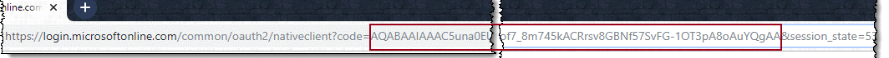
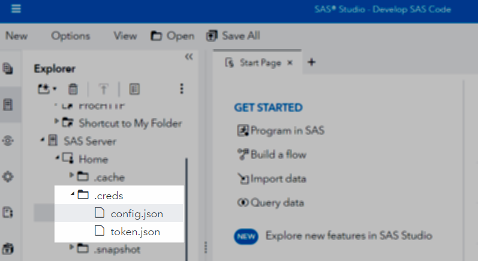
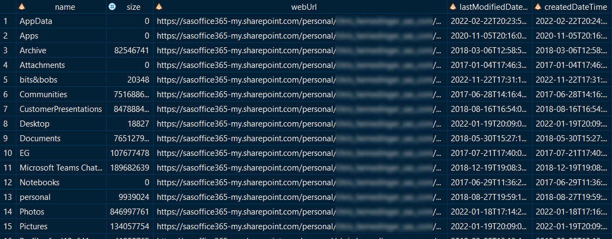
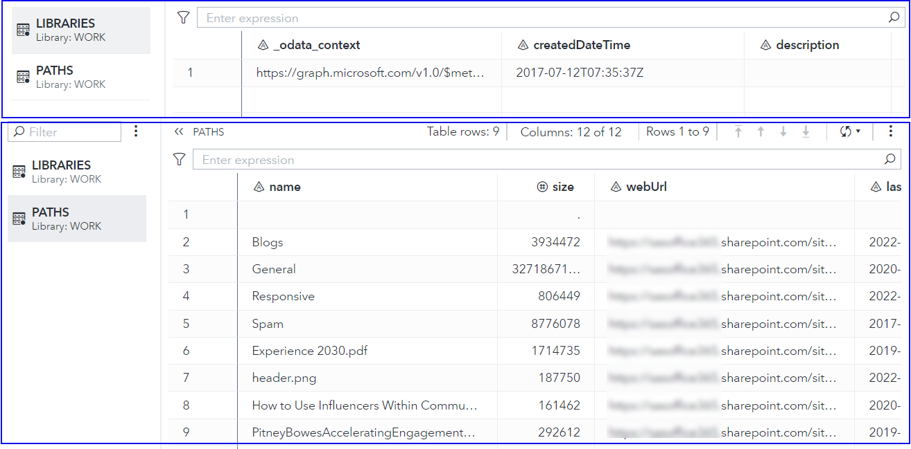
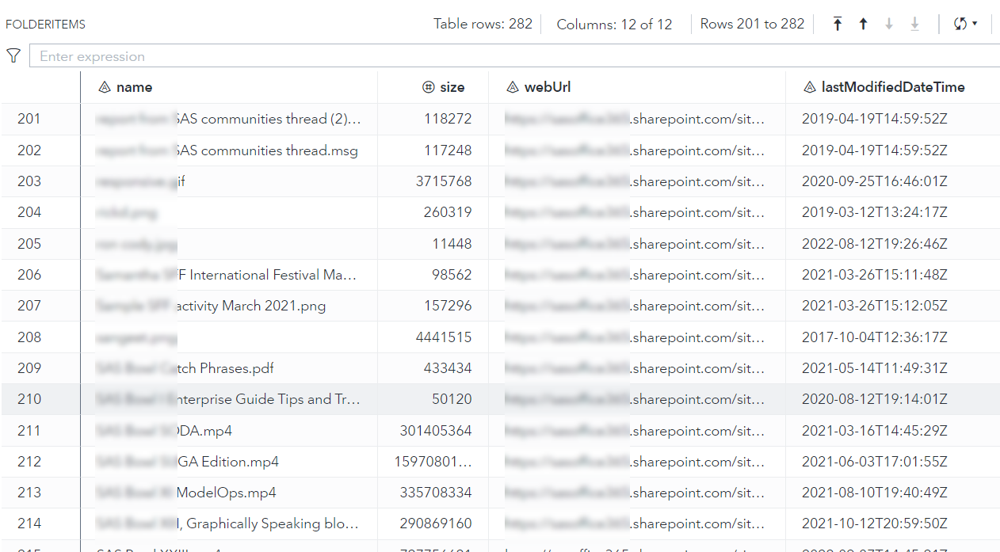

# Using the Microsoft Graph API from SAS

The SAS code and macros in this project are designed to make common tasks
easier when using SAS to access Microsoft 365 content. This includes OneDrive and
SharePoint Online (including content in Microsoft Teams).

To use SAS or any scripting language with Microsoft 365, you must first register a 
client app, authenticate with your identity to grant it permissions, and obtain an
authorization code. With the auth code in hand, you can then use the code routines in this
project to get an access token and invoke API methods to accomplish tasks such as:

* List available drives in OneDrive
* List folders and files within OneDrive and SharePoint folders (include files within Microsoft Teams)
* Download files from OneDrive or SharePoint into your SAS session
* Upload files from SAS to a folder on OneDrive or SharePoint

For more guidance about how to register a client app for use with the Microsoft Graph API,
see [Using SAS with Microsoft 365](https://blogs.sas.com/content/sasdummy/2020/07/09/sas-programming-office-365-onedrive/). 

**Watch**: [Demo: SAS Viya Workbench and SAS code to access Microsoft 365](https://communities.sas.com/t5/SAS-Viya-Workbench-Getting/Demo-SAS-Viya-Workbench-and-SAS-code-to-access-Microsoft-365/ta-p/952476) -- see this macro library in action. Note that these macros work from any SAS environment: PC SAS, SAS Enterprise Guide, SAS 9 and SAS Viya. 

## Approach: Access Microsoft 365 on behalf of the SAS user

The methods documented and implemented in this macro library rely on a user-level authentication using OAuth2. Authentication is managed by generating and refreshing tokens, which must be then provided with every API call. To succeed, you (or someone in your organization) must be able to define an application that can be managed and accessed in this way. See the following topics for more information:

* [Get access on behalf of a user](https://learn.microsoft.com/en-us/graph/auth-v2-user?tabs=http) (Microsoft Graph API)
* [OAuth 2.0 authorization code flow](https://learn.microsoft.com/en-us/entra/identity-platform/v2-oauth2-auth-code-flow) (Microsoft Graph API) -- specifically the flow described for ["mobile and native apps"](https://learn.microsoft.com/en-us/entra/identity-platform/v2-app-types#mobile-and-native-apps)

## Working within a firewall: Preparing your environment

These methods use APIs from Microsoft to access your Microsoft 365 content. Microsoft 365 services are hosted in the cloud by Microsoft, and so your SAS session needs to be able to access these Internet services.

If your SAS session is in a hosted environment or running behind a firewall that does not have direct access to the Internet, you need to perform a few additional steps to enable these methods.

**Read:** [How to test PROC HTTP and Internet access in your environment](https://blogs.sas.com/content/sasdummy/2018/01/23/check-json-and-http/)

### Working with an HTTP proxy

The code in this project uses PROC HTTP without proxy options. If your organization requires a proxy gateway to access the internet, 
specify the proxy value in the [special PROCHTTP_PROXY macro variable](https://go.documentation.sas.com/doc/en/pgmsascdc/v_063/proc/p0m87fzxykv1vyn14rftls0mbrkm.htm):
```
%let PROCHTTP_PROXY=proxyhost.company.com:889;
```
Add this line before calling any other actions. PROC HTTP will apply this proxy value for all methods.

### Modify the Allow List (whitelist) for Microsoft 365 endpoints

If the network rules for your SAS environment block all Internet traffic except for endpoints or IP addresses that are explicitly permitted, then you will need to add at least the following endpoints to the allow list (_whitelist_).

* `login.microsoftonline.com` - for authentication and token refresh
* `graph.microsoft.com` - for API calls to the Microsoft Graph API
* _your-tenant-site_`.sharepoint.com` - for downloadable files from your SharePoint and Teams sites. Example: `contoso.sharepoint.com`.
* _your-tenant-site_`-my.sharepoint.com` - for OneDrive files folders (those with /personal in the path). Example: `contoso-my.sharepoint.com` The naming convention may vary, so check how your organization differentiates Teams and SharePoints site from OneDrive locations.

> **Note:** Micrososoft [publishes a complete list of IP ranges](https://learn.microsoft.com/en-us/microsoft-365/enterprise/urls-and-ip-address-ranges?view=o365-worldwide) to enable Microsoft 365 clients within a firewall, but the list is extensive and only a subset of these are needed for most SAS use cases.

## Using Microsoft 365 in an Azure Government Tenant

Microsoft provides an Azure government service for US Federal, State, and government partner/contractor organizations. If this applies to your tenant, your login and API URLs may be slightly different. For example, instead of `https://login.microsoftonline.com` you might use `https://login.microsoftonline.us`. (Note the **.us** as the domain suffix.)

This macro library uses the default endpoints for commercial tenants, but you can override these by assigning the following macro variables **before** you load/run this macro library.

These are the default values:
```sas
%let msloginBase    = https://login.microsoftonline.com;
%let msgraphApiBase = https://graph.microsoft.com/v1.0;
```

These are *examples* of how you might change them for use with a government tenant. Confirm with your IT or tenant support contacts before making this change.

```sas
%let msloginBase    = https://login.microsoftonline.us;
%let msgraphApiBase = https://graph.microsoft.us/v1.0;
```

If you are running SAS in a hosted environment with firewall rules that control network traffic, be sure to add these URLs to the allow-list. (See previous section about working within a firewall.)

## Create the config.json file with your client app details

These macros use a file named config.json to reference your client app details, including the app ID and your Azure tenant ID. The file has this format:

```json
{
   "tenant_id": "your-azure-tenant",
   "client_id": "your-app-client-id",
   "redirect_uri": "https://login.microsoftonline.com/common/oauth2/nativeclient",
   "resource" : "https://graph.microsoft.com"
}
```
> **NOTE:** Working in an Azure Government tenant? See previous section for guidance on how the redirect_uri and resource URL value might need to change.

Designate a secure location for this file and for your token.json file (to be created in a later step). The information within these files is sensitive and specific to you and should be protected. See [How to protect your REST API credentials in SAS programs for guidance](https://blogs.sas.com/content/sasdummy/2018/01/16/hide-rest-api-tokens/).

If you are using SAS Viya, you can optionally create this folder and file in your SAS Content area that is private to you. For example, create a ".creds" folder within "/Users/your.account/My Folder". By default, only your account will be able to read content you place there.

## Download and include ms-graph-macros.sas code

This repository contains a SAS program (named [ms-graph-macros.sas](./ms-graph-macros.sas)) with all of the macro routines you need for the remaining tasks. Download this file to a local folder and use %INCLUDE to submit in SAS.

```sas
%let src=<my-local-project>\sas-microsoft-graph-api;
%include "&src./ms-graph-macros.sas";
```

You can also include directly from GitHub:
```sas
/* Run just once in your session */
options dlcreatedir;
%let repopath=%sysfunc(getoption(WORK))/sas-microsoft-graph-api;
libname repo "&repopath.";
data _null_;
    rc = git_clone( 
      "https://github.com/sascommunities/sas-microsoft-graph-api", 
      "&repoPath." 
    			); 
    put 'Git repo cloned ' rc=; 
run;
%include "&repopath./ms-graph-macros.sas";
```

## Initialize the config folder

The macro routines need to know where your config.json and token.json file are located. The ```initConfig``` macro initializes this.

```sas
/* This path must contain your config.json, and will also */
/* be the location of your token.json */
%initConfig(configPath=/u/yourId/Projects/ms365);
```
If you are using SAS Viya and you would like to store your config and token files in the SAS Content folders (instead of the file system), this is supported with a boolean flag on ```initConfig```. For example, if you store config.json in a folder named *.creds* within your SAS Content user home, this tells the macro to look in that folder:

```
%initConfig(configPath=/Users/your.account/My Folder/.creds, sascontent=1);
```

> **Note:** This ```sascontent``` flag is needed to tell the macro to use the FILENAME FILESVC method to access the SAS Content area. It requires a different file access method than traditional file systems.

## DO ONCE: Get an auth code

> **Note:** you need this step only if you haven't already generated an auth code and stored in token.json. See [Step 2 in this article](https://blogs.sas.com/content/sasdummy/2020/07/09/sas-programming-office-365-onedrive/).

This helper macro will generate the URL you can use to generate an auth code.

```sas
%generateAuthUrl();
```

The SAS log will contain a URL that you should copy and paste into your browser. After authenticating to Microsoft 365 and granting permissions, the URL address bar will change to include a ```code=``` value that you need for the next step. **Copy only the code= value, not any other values that follow in the URL.** (Again, this is covered in [Step 2 of this article](https://blogs.sas.com/content/sasdummy/2020/07/09/sas-programming-office-365-onedrive/) -- reference for the specific steps to follow!)



## DO ONCE: Generate the first access token

If you just generated your auth code for the first time or needed to get a new one because the old one was revoked or expired, then you need to use the auth code to get an initial access token.
```sas
/* Note: this code can be quite long -- 700+ characters. */
%let auth_code=PASTE-YOUR-AUTH-CODE-HERE;

/*
  Now that we have an authorization code we can get the access token
  This step will write the token.json file that we can use in our
  production programs.
*/
%get_access_token(&auth_code.);

```
When successful, token.json will be created/updated in the config directory you specified.

You should now have both config.json and token.json in your designated config folder. This screenshot shows an example of these files in a hidden folder named "~/.creds".



## Refresh access token and connect to Microsoft 365

Use the ```%initSessionMS365``` macro routine to exchange the refresh-token stored in token.json for an active non-expired access token.

```sas
 %initSessionMS365;
```

When this is successful, you will see notes similar to these in the SAS log:

```
M365: Reading token info from token.json
M365: Token expires on 26JUL2024:10:04:22
```

The Microsoft Graph API session token is stored in the macro variable ```&access_token```, which is referenced implicitly in the other macro routines in this package.

## Methods to list content, download files, upload files

With a valid access token to connect to Microsoft 365, we can now use various methods to discover and list content within OneDrive and SharePoint (including Teams), and also copy files from these sources into your SAS session, and copy files from SAS into Microsoft 365.

The flow for file discovery is iterative. Each method creates an output data set that can be queried/filtered to a selection of interest, and that will result in an identifier for a folder or file that feeds into the next method.

### Example: List OneDrive contents

This sequence lists your OneDrive "root" drives (you may have more than one), and then lists the contents of the "Documents" drive.
```sas

%listMyDrives(out=work.drives);

/* store the ID value for the drive in a macro variable, where "Documents" is at root */
proc sql noprint;
 select id into: driveId from work.drives where driveDisplayName="Documents";
quit;

%listFolderItems(driveId=&driveId, folderId=root, out=work.folderItems);
```

Example output:



#### Alternate approach using Site and Path

OneDrive site domain is _usually_ a variation of the SharePoint site domain with a `-my` suffix (example: `mysite-my.sharepoint.com`). Instead of starting with `%listMyDrives` you can use `%listSiteLibraries`:

```sas
/* this macro fetches the root of your OneDrive. /personal/path name convention may differ for your site */
%listSiteLibraries(
 siteHost=mysite-my.sharepoint.com,
 sitePath=/personal/firstname_lastname_company_com,
 out=libraries);

/* store the ID value for the library in a macro variable, where "OneDrive" is at root */
proc sql noprint;
 select id into: libraryId from libraries where name="OneDrive";
quit;

/* LIST TOP LEVEL FOLDERS/FILES */

/* special macro to pull ALL items from root folder */
%listFolderItems(driveId=&libraryId., folderId=root, out=work.paths);
```

The advantage of this method is it's consistent with how you access folders and files on SharePoint or Teams (described in the next section).

### Example: List SharePoint folders files

Here's an example code flow:
```sas
/* this macro fetches the root IDs for document libraries in your site */
%listSiteLibraries(
 siteHost=mysite.sharepoint.com,
 sitePath=/sites/Department,
 out=libraries);

/* store the ID value for the library in a macro variable, where "Documents" is at root */
proc sql noprint;
 select id into: libraryId from libraries where name="Documents";
quit;

/* LIST TOP LEVEL FOLDERS/FILES */

/* special macro to pull ALL items from root folder */
%listFolderItems(driveId=&libraryId., folderId=root, out=work.paths);
```
Example output:


```sas

/* LIST ITEMS IN A SPECIFIC FOLDER */

/*
 At this point, if you want to act on any of the items, you just replace "root" 
 with the ID of the item. So to list the items in the "General" folder I have:
  - find the ID for that folder
  - list the items within using %listFolderItems and passing that folder ID
*/

/* Find the ID of the folder I want */
proc sql noprint;
 select id into: folder from paths
  where name="General";
quit;

/* Pull ALL items from a folder */
%listFolderItems(driveId=&libraryId., folderId=&folder., out=work.folderItems);
```

Example output (data set):



### Example: Download a file from SharePoint to your SAS session

```sas
/*
 With a valid source folderId and knowledge of the items in this folder, 
 we can download any file of interest.

 This example downloads a file named "ScoreCard2022.xlx" from a known
 folder on SharePoint (obtained in previous steps) and places it in a
 file location on the SAS session.
*/
%downloadFile(driveId=&driveId., 
  folderId=&folder., 
  sourceFilename=ScoreCard2022.xlsx, 
  destinationPath=/tmp);

/* Downloaded an Excel file into SAS? Now we can PROC IMPORT if we want */
proc import file="/tmp/ScoreCard2022.xlsx" 
 out=xldata
 dbms=xlsx replace;
run;
```

### Example: Upload a file from SAS to SharePoint

```sas
/* Create a sample file to upload */
%let targetFile=iris.xlsx;
filename tosave "%sysfunc(getoption(WORK))/&targetFile.";
ods excel(id=upload) file=tosave;
proc print data=sashelp.iris;
run;
ods excel(id=upload) close;

/* Upload to the "General" folder, the folder ID from previous step */
%uploadFile(driveId=&libraryId.,
  folderId=&folder.,
  sourcePath=%sysfunc(getoption(WORK)),
  sourceFilename=&targetFile.);
```

Notes:

* The "list" methods (such as ```listFolderItems```) have special handling to use multiple API calls to gather a complete list of results. The Microsoft Graph API methods return a max of 200 items in a response with an indicator if there are more. These SAS macros will follow through and gather the complete list.

* The ```uploadFile``` method uses the special "large file upload" handling to create an upload session that can accommodate files larger than the 4MB size that is the default size limit.

### Use any Microsoft Graph API endpoint

With the authenticated session established, you can use PROC HTTP to execute any API endpoint that your app permissions allow. 
For example, with User.Read (most apps have this), you can download your own account profile photo:

```sas
filename img "c:/temp/profile.jpg";
proc http url="&msgraphApiBase./me/photo/$value"
   method='GET'
   oauth_bearer="&access_token"
   out = img;
run;
```

The `msgraphApiBase` and `access_token` macro variables are set during ```%initSessionMS365``` macro routine.

This example shows how to retrieve the SharePoint Lists that are defined at the site root. The */sites/root/lists* endpoint requires Sites.Read.All permission.

```sas
filename resp temp;
proc http url="&msgraphApiBase./sites/root/lists"
   method='GET'
   oauth_bearer="&access_token"
   out = resp;
run;

libname lists JSON fileref=resp;
proc sql;
   create table work.list_names as 
   select t1.name, 
          t1.displayname, 
          t1.weburl, 
          t2.template
      from lists.value t1
           inner join lists.value_list t2 on 
            (t1.ordinal_value = t2.ordinal_list);
quit;
```

All APIs are documented in the [Microsoft Graph API reference](https://learn.microsoft.com/en-us/graph/api/overview?view=graph-rest-1.0). 

## Troubleshooting

There are several moving parts when using these macros to access your Microsoft 365 content. Once you get it working, it's a beautiful thing. Here are some of the stumbling blocks you might face with some tips for how to fix them.

* Make sure that the application ID and tenant ID are correct in the config.json file. Your IT support staff should be able to provide these, but you can find them yourself by visiting the Azure Portal (usually `portal.azure.com`). For the tenant ID, navigate to **Microsoft Entra ID** and look at the Overview tab. The Tenant ID should be front-and-center with a button to copy it to your clipboard.
* Make sure your application has the correct delegated permissions. For most use cases you will need **Files.ReadWrite.All** and **Sites.ReadWrite.All**.
* Make sure that your SAS environment (where you are running the code that uses these macros) has access to the Internet, and specifically the endpoints needed for these APIs to work. (See the section about Firewalls earlier in this document.)
* If you're seeing HTTP errors when running the macros, set `%let _DEBUG_=3;` to enable more debugging output in the SAS log. This will show you the full content of each PROC HTTP request and response when getting and refreshing the access token. The additional information might help determine where the problem is.